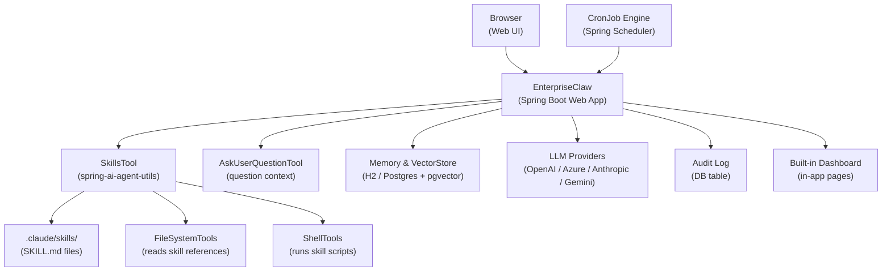
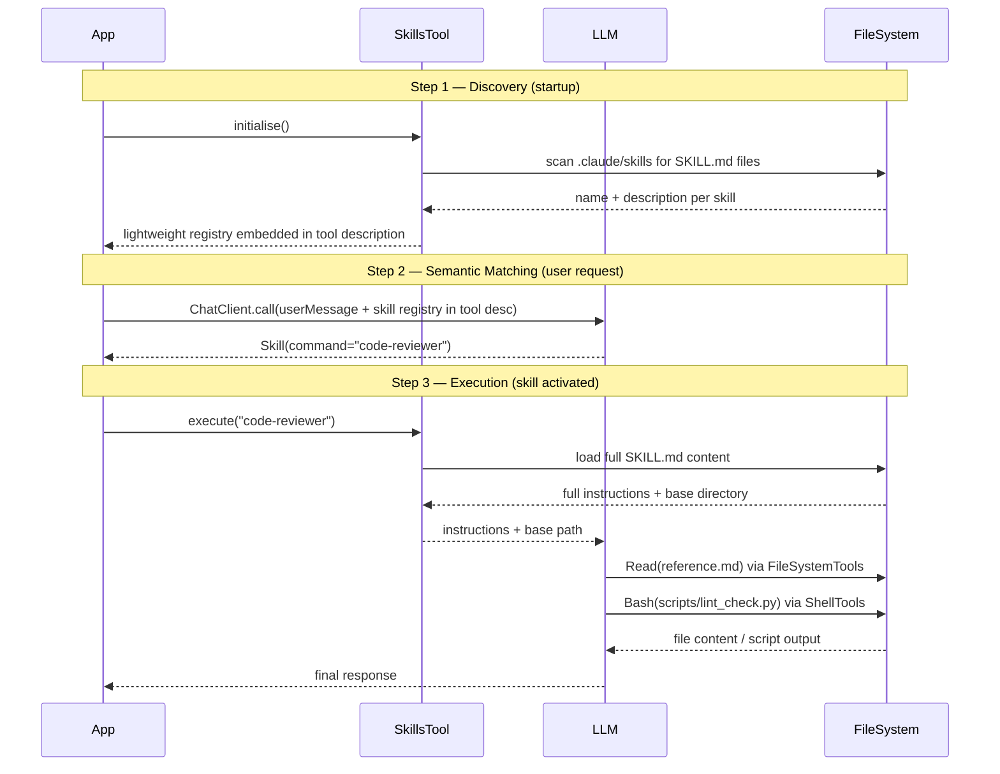
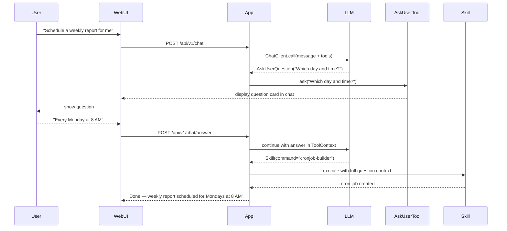
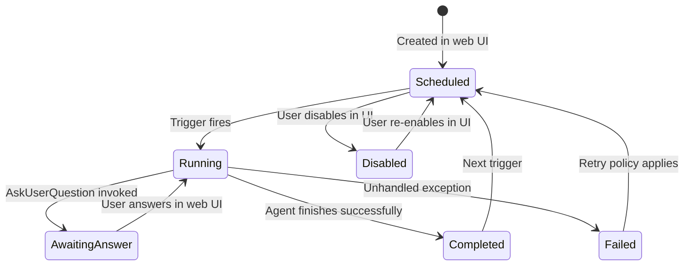
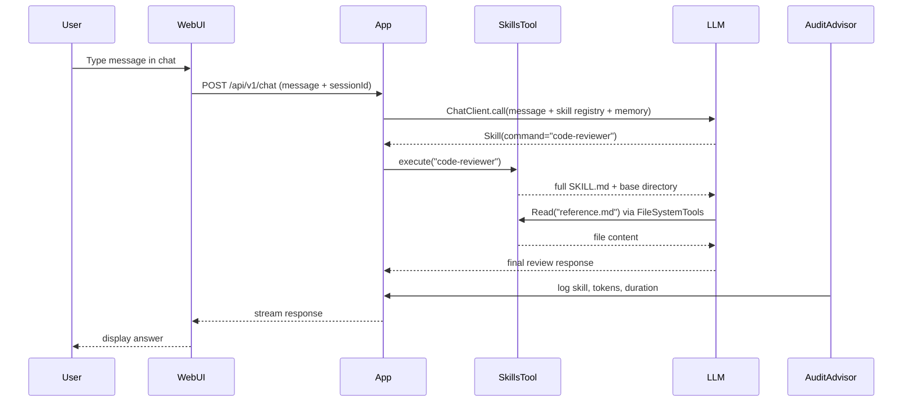
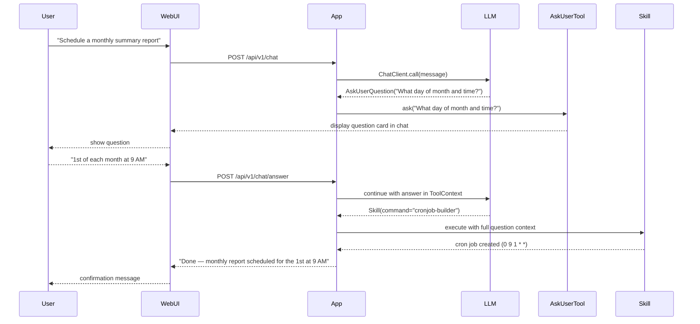
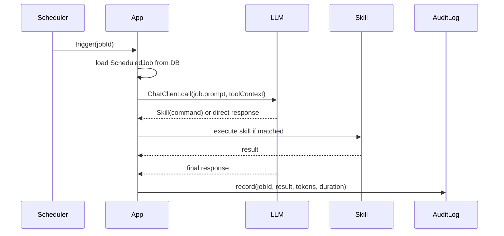
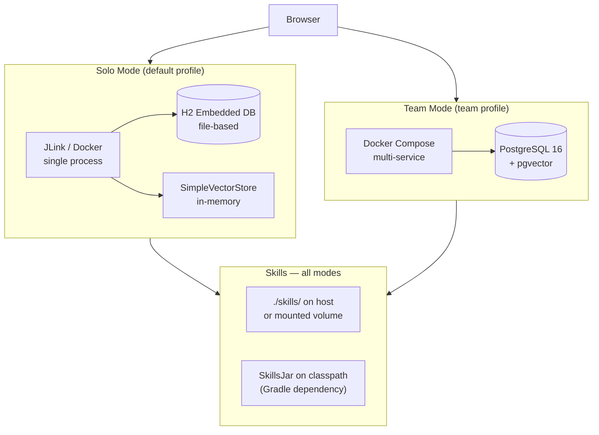

# Technical Requirements Document: EnterpriseClaw

## Table of Contents

- [1. Overview](#1-overview)
- [2. Inspiration and Scope](#2-inspiration-and-scope)
- [3. Architecture Overview](#3-architecture-overview)
- [4. Spring AI Integration](#4-spring-ai-integration)
- [5. Agent Skills](#5-agent-skills)
- [6. Interactive Question Context](#6-interactive-question-context)
- [7. Built-in Observability Dashboard](#7-built-in-observability-dashboard)
- [8. Scheduled Tasks (CronJob)](#8-scheduled-tasks-cronjob)
- [9. Technical Stack](#9-technical-stack)
- [10. Installation](#10-installation)
- [11. Non-Functional Requirements](#11-non-functional-requirements)
- [12. Data Flow](#12-data-flow)
- [13. Deployment Modes](#13-deployment-modes)
- [14. Open Questions and Future Considerations](#14-open-questions-and-future-considerations)

---

## 1. Overview

EnterpriseClaw is an AI-native agentic platform inspired by OpenClaw, built fully on Spring AI. It ships as a **single self-contained web application** that works equally well for an individual developer running it locally and for an enterprise team running it on a shared server. No external monitoring infrastructure, no CLI tools, and no complex cluster setup are required.

Install options span from a compact JLink runtime image for distribution, to a Docker single container, to a Docker Compose stack for a team. Open a browser and you are ready.

### 1.1 Goals

- Provide a first-class Spring AI runtime for multi-agent, multi-model workflows using `spring-ai-agent-utils`.
- Implement Agent Skills as declarative `SKILL.md` files — modular, reusable, and LLM-agnostic.
- Support interactive question-context workflows with `AskUserQuestionTool` so agents ask clarifying questions before acting.
- Ship as a self-contained web application with a built-in browser UI — no CLI needed.
- Support three installation paths: JLink runtime image, Docker, and Docker Compose.
- Deliver built-in observability through an in-app dashboard — no Grafana, Prometheus, or external tools required.
- Support scheduled AI workloads (CronJobs) managed entirely from the web UI.
- Run identically for a solo user (embedded H2, single process) and for an enterprise team (PostgreSQL, multi-user).

### 1.2 Non-Goals

- EnterpriseClaw does not replace or compete with the Spring AI library or `spring-ai-agent-utils`; it builds on them.
- It does not ship its own LLM; it connects to external providers through Spring AI's `ChatModel` abstraction.
- It does not require any external monitoring tools such as Grafana, Prometheus, Loki, or Tempo.
- It does not expose a command-line interface; all interaction happens through the web application.

---

## 2. Inspiration and Scope

### 2.1 OpenClaw Concepts Adopted

| OpenClaw Concept | EnterpriseClaw Equivalent |
|---|---|
| Agent loop | Spring AI `ChatClient` + `SkillsTool` |
| Tool / Function calling | `SkillsTool` with `SKILL.md` definitions (LLM-agnostic) |
| Memory | Spring AI `VectorStore` + `MessageWindowChatMemory` |
| Planning | ReAct / Plan-and-Execute patterns via `ChatClient` + `TodoWriteTool` |
| Interactive clarification | `AskUserQuestionTool` — agent asks the user questions mid-workflow |
| Multi-agent routing | Supervisor pattern with `ChatClient` routing chains |

### 2.2 Additions over OpenClaw

- **`SkillsTool` (spring-ai-agent-utils)**: Skills are plain `SKILL.md` Markdown files, not compiled Java code. Add or update a skill without redeploying the application.
- **Question Context**: `AskUserQuestionTool` lets the agent pause and ask clarifying questions before executing a skill or cron job, collecting just enough context to proceed correctly.
- **Built-in Web UI**: Full browser interface for chat, skill editor, cron jobs, and observability pages.
- **Three-Way Install**: JLink self-contained image, Docker, or Docker Compose — choose what fits the user's environment.
- **Dual Mode**: The same binary runs in solo mode (no auth, embedded H2) or team mode (multi-user, PostgreSQL) via one flag.
- **Audit Log**: Immutable record of every agent action, skill invocation, and question–answer pair, viewable in the web UI.

---

## 3. Architecture Overview



### 3.1 Component Responsibilities

| Component | Responsibility |
|---|---|
| **Browser (Web UI)** | All user interaction — chat, skill editor, cron management, dashboard, audit log |
| **EnterpriseClaw App** | Spring Boot host; owns agent loop, web layer, REST APIs, Spring AI beans |
| **SkillsTool** | Discovers `SKILL.md` files at startup; semantically matches user requests to skills at runtime |
| **FileSystemTools** | Reads skill reference files and templates on demand during skill execution |
| **ShellTools** | Executes helper scripts bundled inside a skill folder |
| **AskUserQuestionTool** | Pauses the agent loop and asks the user a clarifying question; injects the answer into context |
| **Memory & VectorStore** | Stores conversation history and semantic embeddings for RAG |
| **LLM Providers** | Abstracted via Spring AI `ChatModel`; no vendor lock-in |
| **CronJob Engine** | Triggers scheduled agent runs; supports optional question context before execution |
| **Built-in Dashboard** | In-app pages showing agent run history, skill usage, token counts, cron health |
| **Audit Log** | Append-only DB table recording every skill call, LLM interaction, question–answer pair |

---

## 4. Spring AI Integration

EnterpriseClaw uses Spring AI as its sole AI abstraction layer. No AI calls are made outside of the Spring AI programming model.

### 4.1 ChatClient with SkillsTool

The `ChatClient` fluent API wraps `SkillsTool`, `AskUserQuestionTool`, `FileSystemTools`, and `ShellTools` together:

```java
@Configuration
public class AgentConfig {

    @Bean
    public ChatClient chatClient(ChatClient.Builder builder,
                                 SkillsTool skillsTool,
                                 AskUserQuestionTool questionTool,
                                 ChatMemory chatMemory) {
        return builder
            .defaultToolCallbacks(skillsTool)                   // SkillsTool implements ToolCallback
            .defaultTools(questionTool)                         // AskUserQuestionTool uses @Tool methods
            .defaultTools(FileSystemTools.builder().build())    // FileSystemTools uses @Tool methods
            .defaultTools(ShellTools.builder().build())         // ShellTools uses @Tool methods
            .defaultAdvisors(new MessageChatMemoryAdvisor(chatMemory))
            .build();
    }
}
```

### 4.2 Models and Providers

Spring AI auto-configuration supports multiple providers simultaneously. Skills are LLM-agnostic — the same `SKILL.md` works with any model:

```yaml
spring:
  ai:
    openai:
      api-key: ${OPENAI_API_KEY}
      chat:
        options:
          model: gpt-4o
    anthropic:
      api-key: ${ANTHROPIC_API_KEY}
      chat:
        options:
          model: claude-sonnet-4-5-20250929
```

### 4.3 Embedding and Vector Store

Use Spring AI `EmbeddingModel` + `VectorStore` for RAG. In solo mode the `SimpleVectorStore` (in-memory) is used automatically. In team mode switch to `PgVectorStore`:

```java
@Bean
@ConditionalOnProperty(name = "enterpriseclaw.mode", havingValue = "team")
public VectorStore pgVectorStore(EmbeddingModel embeddingModel, JdbcTemplate jdbc) {
    return new PgVectorStore(jdbc, embeddingModel);
}
```

### 4.4 Advisors

Compose cross-cutting concerns via Spring AI `Advisor` chain:

| Advisor | Purpose |
|---|---|
| `MessageChatMemoryAdvisor` | Injects conversation history into each request |
| `QuestionAnswerAdvisor` | Performs RAG retrieval before calling the model |
| `SafeGuardAdvisor` | Blocks prompts containing disallowed content |
| `EnterpriseAuditAdvisor` | Custom advisor; records every request/response to the audit log |

### 4.5 Structured Output

Use Spring AI `BeanOutputConverter` and `StructuredOutputConverter` to parse model responses into typed Java objects, ensuring downstream reliability.

---

## 5. Agent Skills

EnterpriseClaw implements the [Spring AI Agentic Patterns — Agent Skills](https://spring.io/blog/2026/01/13/spring-ai-generic-agent-skills) pattern using `spring-ai-agent-utils`. Skills are plain Markdown files — no Java code required to add or change a skill.

### 5.1 What a Skill Is

A skill is a folder inside `.claude/skills/` containing a `SKILL.md` file with YAML frontmatter and instructions. Supporting files are optional:

```
.claude/skills/
└── code-reviewer/
    ├── SKILL.md              # Required: metadata + instructions
    ├── reference.md          # Optional: detailed documentation
    ├── scripts/
    │   └── lint_check.py     # Optional: helper script
    └── examples.md           # Optional: usage examples
```

### 5.2 SKILL.md Format

```markdown
---
name: code-reviewer
description: Reviews Java code for best practices, security issues, and Spring
  Framework conventions. Use when user asks to review, analyze, or audit code.
allowed-tools: Read, Grep, Bash
model: gpt-4o
---

# Code Reviewer

## Instructions
When reviewing code:
1. Check for security vulnerabilities (SQL injection, XSS, etc.)
2. Verify Spring Boot conventions (@Service, @Repository, etc.)
3. Look for potential null pointer exceptions
4. Suggest improvements for readability and maintainability
5. Provide specific, line-by-line feedback with code examples

## Additional Resources
- For Spring Security patterns, see [reference.md](reference.md)
- To run static analysis: `python scripts/lint_check.py <file>`
```

### 5.3 SKILL.md Frontmatter Fields

| Field | Required | Description |
|---|---|---|
| `name` | Yes | Skill identifier — lowercase, hyphens only, max 64 chars |
| `description` | Yes | What the skill does and when to use it (max 1024 chars). Used for semantic matching by the LLM |
| `allowed-tools` | No | Tools the agent can invoke without asking permission (e.g., `Read, Grep, Bash`) |
| `model` | No | Override the default model for this specific skill |

Write rich, keyword-dense descriptions — this is what the LLM reads to decide whether to activate a skill. Include both capability phrases ("reviews Java code") and user-facing trigger keywords ("review, analyze, audit").

### 5.4 Three-Step Execution Flow



Only `name` and `description` are loaded at startup — the full skill content enters context only when the LLM activates it, keeping the context window lean even with hundreds of registered skills.

### 5.5 Registering SkillsTool

```java
@Bean
public SkillsTool skillsTool(ResourceLoader resourceLoader) {
    return SkillsTool.builder()
        .addSkillsDirectory(".claude/skills")                            // project skills
        .addSkillsResource(                                              // skills from JAR
            resourceLoader.getResource("classpath:.claude/skills"))
        .build();
}
```

Multiple sources — filesystem directories, classpath locations, and remote JAR URLs — can be mixed freely in one builder.

### 5.6 Built-in Skill Categories

| Category | Skill Name | Description / Trigger Keywords |
|---|---|---|
| **Code Review** | `code-reviewer` | review, audit, analyze code, best practices |
| **Web Search** | `web-search` | search, look up, find information online |
| **Document Generation** | `doc-generator` | generate docs, write documentation, README |
| **Data Analysis** | `data-analyst` | analyze data, CSV, spreadsheet, statistics |
| **Email Drafting** | `email-drafter` | write email, draft message, compose reply |
| **CronJob Builder** | `cronjob-builder` | schedule task, remind me, run every day |
| **PDF Processing** | `pdf-processor` | PDF, extract text, parse document, forms |
| **API Integration** | `api-integrator` | call API, REST, fetch from endpoint |

### 5.7 Packaging Skills as a SkillsJar

Reusable skill packs can be distributed as Maven/Gradle dependencies — a regular JAR with skills stored under `META-INF/skills/`:

```
META-INF/
└── skills/
    └── enterpriseclaw/
        └── standard-skills/
            ├── code-reviewer/
            │   └── SKILL.md
            └── data-analyst/
                └── SKILL.md
```

```kotlin
// build.gradle.kts — consuming a shared SkillsJar
dependencies {
    implementation("com.enterpriseclaw:standard-skills:1.0.0")
}
```

```java
SkillsTool.builder()
    .addSkillsResource(new ClassPathResource(
        "META-INF/skills/enterpriseclaw/standard-skills"))
    .build();
```

### 5.8 Security Notes

- Scripts inside skill folders execute on the host machine via `ShellTools`. Review all third-party skills before registering them.
- Run EnterpriseClaw inside Docker to limit filesystem and network exposure of skill scripts.
- Skills that trigger external side-effects should include an explicit approval prompt in their instructions, causing the agent to invoke `AskUserQuestionTool` for confirmation before proceeding.

---

## 6. Interactive Question Context

`AskUserQuestionTool` (from `spring-ai-agent-utils`) gives agents the ability to pause mid-workflow and ask the user a clarifying question. This is the **question context** pattern — the agent collects just enough information before invoking a skill or scheduling a cron job.

### 6.1 How It Works



### 6.2 Registration

```java
@Bean
public AskUserQuestionTool askUserQuestionTool() {
    return AskUserQuestionTool.builder().build();
}
```

Register it alongside `SkillsTool` in the `ChatClient`:

```java
ChatClient chatClient = builder
    .defaultToolCallbacks(skillsTool)
    .defaultTools(askUserQuestionTool)
    .build();
```

### 6.3 ToolContext — Runtime Context Injection

`ToolContext` is Spring AI's immutable context map passed to every tool invocation. EnterpriseClaw uses it to carry session-level metadata that skills and tools can read without the LLM having to repeat it in every prompt:

```java
chatClient.prompt()
    .user(userMessage)
    .toolContext(Map.of(
        "userId",    currentUser.getId(),
        "mode",      appMode,        // "solo" or "team"
        "timezone",  userTimezone,
        "sessionId", sessionId
    ))
    .call()
    .content();
```

Inside a custom `ToolCallback` or a skill's audit interceptor, this context is available as:

```java
public class AuditToolCallback implements ToolCallback {
    @Override
    public String call(String toolInput, ToolContext ctx) {
        String userId = ctx.getContext().get("userId").toString();
        // record audit entry attributed to this user
    }
}
```

### 6.4 Question Context in CronJobs

When a user creates a cron job from the web UI, the scheduler injects the job owner's context before each run. If the stored prompt is ambiguous, the agent may invoke `AskUserQuestionTool` automatically — directing the question to the job owner via the web UI's notification area:

```java
chatClient.prompt()
    .user(job.getPrompt())
    .toolContext(Map.of(
        "jobId",  job.getId(),
        "userId", job.getOwnerUserId(),
        "mode",   "scheduled"
    ))
    .call()
    .content();
```

---

## 7. Built-in Observability Dashboard

All observability is built into the EnterpriseClaw web application. No Grafana, Prometheus, Loki, Tempo, or any external monitoring tool is required to operate the platform.

### 7.1 What the Dashboard Shows

| Dashboard Page | Data Displayed |
|---|---|
| **Agent Runs** | Timeline of all agent interactions, status, skill activated, model used |
| **Skill Usage** | Invocation count per skill, last used, error rate, average response |
| **LLM Usage** | Prompt tokens, completion tokens, estimated cost per session and per day |
| **CronJob Health** | Execution history, last run status, next scheduled run, missed count |
| **Audit Log** | Searchable, paginated record of every agent action, question–answer pair, and tool call |
| **Question History** | All `AskUserQuestion` interactions — question asked, answer given, which skill followed |

All data is stored in the application's own database and queried directly by the built-in dashboard controllers.

### 7.2 How Metrics Are Collected

A custom `EnterpriseAuditAdvisor` intercepts every `ChatClient` request and response and writes a structured row to the `agent_run_log` table:

```java
@Component
public class EnterpriseAuditAdvisor implements CallAroundAdvisor {

    private final AuditLogRepository auditLog;

    @Override
    public AdvisedResponse aroundCall(AdvisedRequest req, CallAroundAdvisorChain chain) {
        Instant start = Instant.now();
        AdvisedResponse resp = chain.nextAroundCall(req);
        auditLog.save(AgentRunEntry.builder()
            .userId(req.toolContext().get("userId").toString())
            .sessionId(req.toolContext().get("sessionId").toString())
            .promptTokens(resp.response().getMetadata().getUsage().getPromptTokens())
            .completionTokens(resp.response().getMetadata().getUsage().getGenerationTokens())
            .skillActivated(extractSkillName(resp))
            .durationMs(Duration.between(start, Instant.now()).toMillis())
            .build());
        return resp;
    }
}
```

### 7.3 Spring Boot Actuator (Internal Use Only)

Spring Boot Actuator's `/actuator/health` and `/actuator/info` endpoints are enabled for the built-in dashboard's health indicator page. They are **not** exposed as a Prometheus scrape target — no external collector is needed:

```yaml
management:
  endpoints:
    web:
      exposure:
        include: health, info
```

---

## 8. Scheduled Tasks (CronJob)

The CronJob engine uses Spring `TaskScheduler` for all scheduling. Jobs are created and managed from the web UI.

### 8.1 How a CronJob Works

A `ScheduledJob` entity is persisted in the database and registered with a `TaskScheduler` at startup and whenever a job is created or updated. When a job fires, it runs an agent with the stored prompt. The agent may invoke `AskUserQuestionTool` if the prompt needs clarification:

```java
@Component
public class DynamicCronJobRunner {

    private final TaskScheduler scheduler;
    private final ChatClient chatClient;

    public void register(ScheduledJob job) {
        scheduler.schedule(
            () -> runJob(job),
            new CronTrigger(job.getCronExpression())
        );
    }

    private void runJob(ScheduledJob job) {
        chatClient.prompt()
            .user(job.getPrompt())
            .toolContext(Map.of(
                "jobId",  job.getId(),
                "userId", job.getOwnerUserId(),
                "mode",   "scheduled"
            ))
            .call()
            .content();
    }
}
```

### 8.2 CronJob Lifecycle



### 8.3 CronJob Management API (Used by Web UI)

| Method | Path | Description |
|---|---|---|
| `GET` | `/api/v1/cronjobs` | List all cron jobs for the current user |
| `GET` | `/api/v1/cronjobs/{id}` | Get details and last-run status |
| `POST` | `/api/v1/cronjobs` | Create a new cron job with a prompt and expression |
| `PUT` | `/api/v1/cronjobs/{id}/schedule` | Update the cron expression |
| `POST` | `/api/v1/cronjobs/{id}/trigger` | Manually trigger a job |
| `POST` | `/api/v1/cronjobs/{id}/disable` | Disable a job |
| `POST` | `/api/v1/cronjobs/{id}/enable` | Re-enable a job |
| `DELETE` | `/api/v1/cronjobs/{id}` | Remove a job |
| `GET` | `/api/v1/cronjobs/{id}/history` | Paginated execution history |

---

## 9. Technical Stack

| Layer | Technology | Version |
|---|---|---|
| Runtime | Java | 21 (LTS) |
| Framework | Spring Boot | 3.4.x |
| AI Framework | Spring AI | 2.0.0-M2+ |
| Agent Skills Toolkit | spring-ai-agent-utils | 0.4.2 |
| Build | Gradle (Kotlin DSL) | 8.x |
| Database (solo) | H2 embedded | via Spring Boot |
| Database (team) | PostgreSQL + pgvector | 16.x |
| Scheduling | Spring `TaskScheduler` | via Spring Boot |
| Security (solo) | None — localhost only | — |
| Security (team) | Spring Security + form login | via Spring Boot 3.4.x |
| Web UI | Thymeleaf + HTMX | — |
| Distribution | JLink / Docker / Docker Compose | — |

### 9.1 Key Dependencies

```kotlin
// build.gradle.kts
dependencies {
    implementation(platform("org.springframework.ai:spring-ai-bom:2.0.0-M2"))
    implementation("org.springframework.ai:spring-ai-starter-model-openai")
    implementation("org.springframework.ai:spring-ai-starter-model-anthropic")
    implementation("org.springframework.ai:spring-ai-starter-vector-store-simple")   // solo mode
    implementation("org.springframework.ai:spring-ai-starter-vector-store-pgvector") // team mode

    implementation("org.springaicommunity:spring-ai-agent-utils:0.4.2") // SkillsTool, AskUserQuestionTool, FileSystemTools, ShellTools

    implementation("org.springframework.boot:spring-boot-starter-web")
    implementation("org.springframework.boot:spring-boot-starter-thymeleaf")
    implementation("org.springframework.boot:spring-boot-starter-data-jpa")
    implementation("org.springframework.boot:spring-boot-starter-actuator")
    implementation("com.h2database:h2")        // solo mode
    implementation("org.postgresql:postgresql") // team mode
}
```

---

## 10. Installation

EnterpriseClaw supports three installation paths. All of them end the same way: open `http://localhost:8080` in your browser.

### 10.1 JLink — Self-Contained Runtime Image

[JLink](https://docs.oracle.com/en/java/javase/21/docs/specs/man/jlink.html) bundles only the JDK modules the application needs into a minimal custom runtime. The resulting image runs without a system JDK installed. The JLink image must be built with the same JDK version (Java 21) as the application is compiled with:

```bash
# Build the JLink image (CI/release pipeline step)
./gradlew jlink

# Resulting layout — copy the entire dist/ folder anywhere
dist/
├── bin/
│   ├── enterpriseclaw          # Linux / macOS launcher
│   └── enterpriseclaw.bat      # Windows launcher
├── lib/                        # minimal JDK modules only
└── .claude/skills/             # bundled default skills
```

Run from the dist folder:

```bash
OPENAI_API_KEY=sk-... ./dist/bin/enterpriseclaw
```

This is the recommended distribution format for enterprise deployments where installing a full JDK on every server is undesirable.

### 10.2 Docker — Single Container

```bash
docker run -p 8080:8080 \
  -e OPENAI_API_KEY=sk-... \
  -v "$(pwd)/.claude/skills":/app/.claude/skills \
  -v enterpriseclaw-data:/app/data \
  ghcr.io/enterpriseclaw/enterpriseclaw:latest
```

Data is persisted in the named volume. Skills mounted from the host are live-reloaded without restarting the container.

### 10.3 Docker Compose — App + PostgreSQL (Recommended for Teams)

Save the following as `docker-compose.yml` and run `docker compose up -d`:

```yaml
services:
  app:
    image: ghcr.io/enterpriseclaw/enterpriseclaw:latest
    ports:
      - "8080:8080"
    environment:
      SPRING_PROFILES_ACTIVE: team
      SPRING_DATASOURCE_URL: jdbc:postgresql://db:5432/enterpriseclaw
      SPRING_DATASOURCE_USERNAME: ec
      SPRING_DATASOURCE_PASSWORD: ${DB_PASSWORD}
      OPENAI_API_KEY: ${OPENAI_API_KEY}
      ANTHROPIC_API_KEY: ${ANTHROPIC_API_KEY}
    volumes:
      - ./skills:/app/.claude/skills
    depends_on:
      db:
        condition: service_healthy
    restart: unless-stopped

  db:
    image: pgvector/pgvector:pg16
    environment:
      POSTGRES_DB: enterpriseclaw
      POSTGRES_USER: ec
      POSTGRES_PASSWORD: ${DB_PASSWORD}
    volumes:
      - pg-data:/var/lib/postgresql/data
    healthcheck:
      test: ["CMD-SHELL", "pg_isready -U ec -d enterpriseclaw"]
      interval: 5s
      retries: 5

volumes:
  pg-data:
```

Create a `.env` file alongside it:

```bash
DB_PASSWORD=changeme
OPENAI_API_KEY=sk-...
ANTHROPIC_API_KEY=sk-ant-...
```

Then start:

```bash
docker compose up -d
# open http://localhost:8080
```

### 10.4 Installation Mode Comparison

| Criterion | JLink Image | Docker | Docker Compose |
|---|---|---|---|
| **Java required** | No (bundled runtime) | No | No |
| **Best for** | Personal use / enterprise distribution | Solo containerised | Team / shared server |
| **Database** | Embedded H2 | Embedded H2 | PostgreSQL |
| **Multi-user** | No | No | Yes (`team` profile) |
| **Skills persistence** | Local filesystem | Mounted volume | Mounted volume |
| **Offline after first run** | Yes | Yes | Yes |

---

## 11. Non-Functional Requirements

### 11.1 Performance

- Skill discovery at startup completes in under 2 seconds for up to 200 registered skills.
- Agent response streaming begins within 1 second of the user submitting a message.
- Skill invocations complete within 5 seconds for synchronous tool calls.
- Scheduled jobs trigger within ±5 seconds of their configured cron expression.

### 11.2 Reliability

- In solo mode, embedded H2 data survives application restarts via file-based persistence.
- CronJob execution is idempotent; a job that fires twice due to a restart must not produce duplicate results.
- If a skill script fails, the agent catches the error and responds with a graceful explanation; it does not crash the application.

### 11.3 Security

- In solo mode, the application binds to `localhost` only and requires no authentication.
- In team mode, all web routes require a valid session (form login); all REST API routes require a bearer token.
- LLM API keys are stored as environment variables — never logged, persisted in the database, or included in audit records.
- Skill scripts execute on the host. Run the application in Docker to limit exposure to the container filesystem.

### 11.4 Usability

- A new user installs and completes their first agent interaction in under 5 minutes using the JLink launcher.
- All features are accessible from the browser; no terminal interaction is needed after the initial launch command.
- The Skills editor in the web UI allows creating and editing `SKILL.md` files without leaving the browser.

### 11.5 Portability

- Skills defined as `SKILL.md` files work unchanged across OpenAI, Anthropic, Azure OpenAI, and Google Gemini.
- The application JAR is platform-neutral; the JLink image is built per OS/arch target.
- Docker and Docker Compose configurations are OS-independent.

---

## 12. Data Flow

### 12.1 Agent Interaction with Skill Activation



### 12.2 Question Context Flow



### 12.3 Scheduled Agent Execution



---

## 13. Deployment Modes

EnterpriseClaw supports three deployment tiers from the same binary, selected by `SPRING_PROFILES_ACTIVE`.



### 13.1 Profile Configuration

```yaml
# application.yml — solo defaults
enterpriseclaw:
  mode: solo
spring:
  datasource:
    url: jdbc:h2:file:./data/enterpriseclaw
  security:
    enabled: false
server:
  address: 127.0.0.1

---
# application-team.yml — team overrides
enterpriseclaw:
  mode: team
spring:
  datasource:
    url: ${SPRING_DATASOURCE_URL}
  security:
    enabled: true
server:
  address: 0.0.0.0
```

---

## 14. Open Questions and Future Considerations

| Topic | Question / Consideration |
|---|---|
| **TodoWriteTool** | Integrate `TodoWriteTool` from `spring-ai-agent-utils` (Part 3 of the agentic patterns series) for transparent, trackable multi-step task management visible in the web UI |
| **Subagent Orchestration** | Evaluate hierarchical sub-agent patterns (Part 4 of the series) for complex long-running workflows that exceed a single context window |
| **A2A Integration** | Adopt the Agent2Agent (A2A) protocol (Part 5 of the series) for interoperability with external agent platforms |
| **Skill Versioning** | Add a versioning strategy (e.g., `.claude/skills/v1/`) to allow safe in-place upgrades of skill instructions |
| **Human-in-the-Loop Approval** | Extend `AskUserQuestionTool` with an explicit approval-gate UI for skills marked as destructive |
| **Cost Governance** | Implement per-user token budget enforcement using data collected by `EnterpriseAuditAdvisor` |
| **Skill Marketplace** | Publish first-party SkillsJars to Maven Central so users can add capabilities as Gradle dependencies |
| **Event-Driven CronJobs** | Allow cron jobs to trigger on webhook calls or database change events in addition to time expressions |
| **Mobile Web UI** | Ensure the Thymeleaf + HTMX UI is fully usable on mobile browsers for on-the-go agent interactions |
