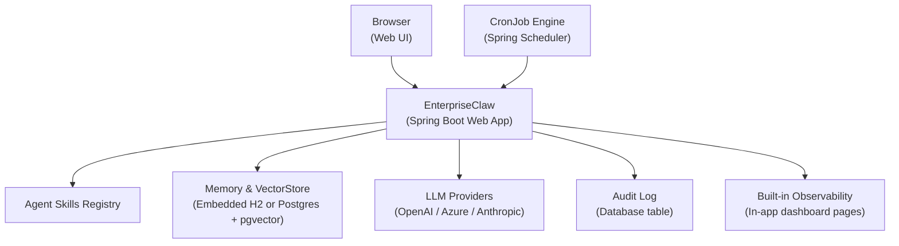
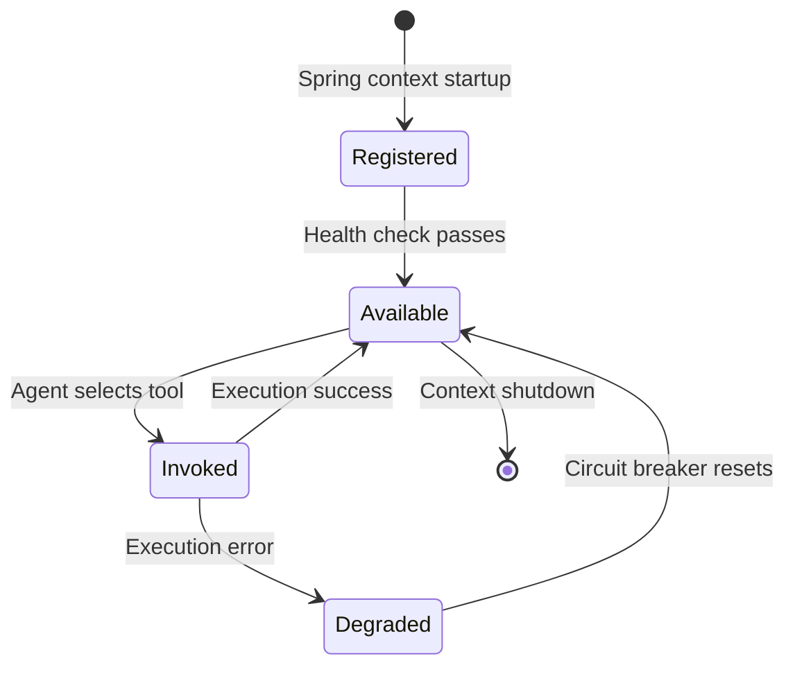
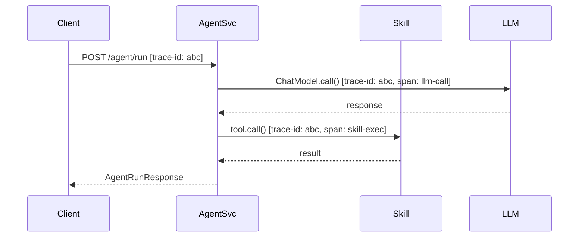
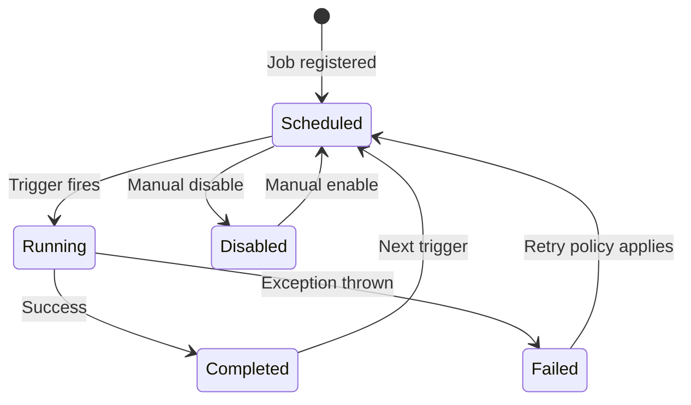
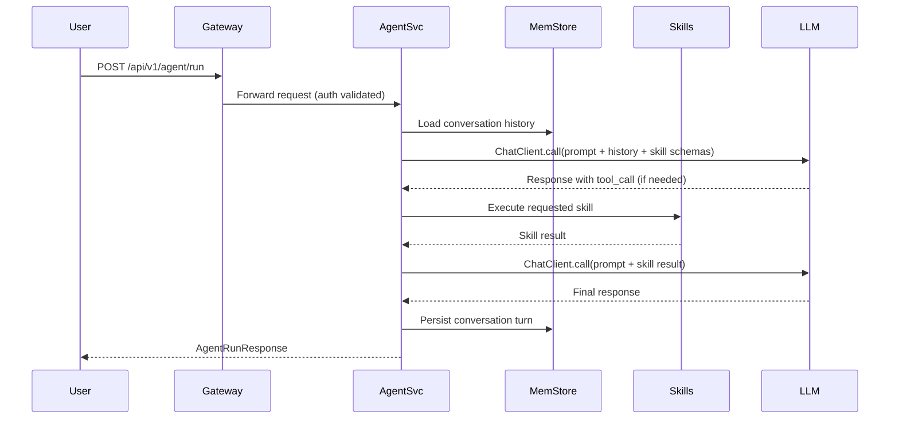
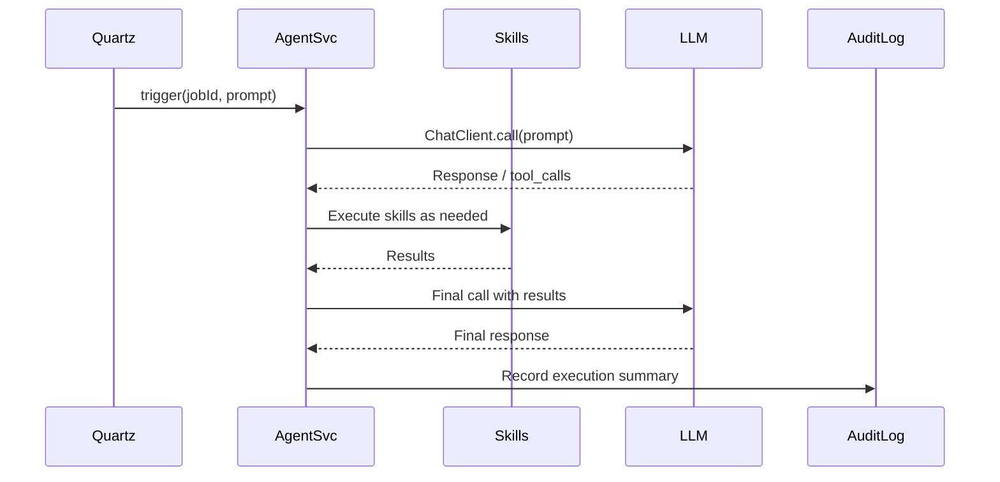
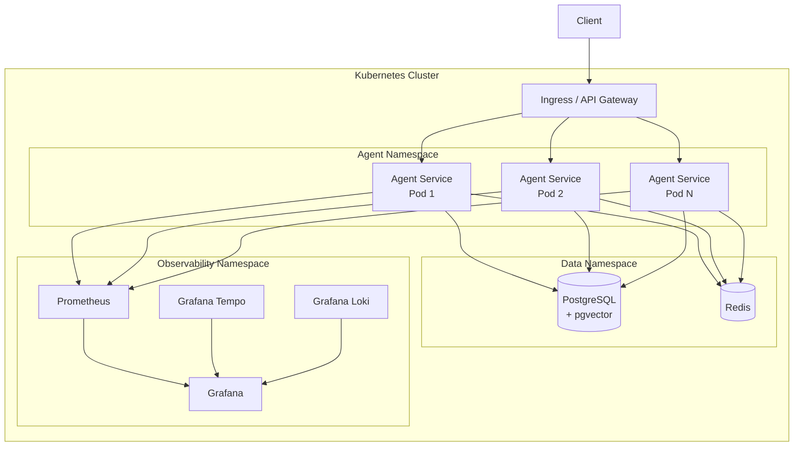

# Technical Requirements Document: EnterpriseClaw

## Table of Contents

- [1. Overview](#1-overview)
- [2. Inspiration and Scope](#2-inspiration-and-scope)
- [3. Architecture Overview](#3-architecture-overview)
- [4. Spring AI Integration](#4-spring-ai-integration)
- [5. Agent Skills](#5-agent-skills)
- [6. Built-in Observability Dashboard](#6-built-in-observability-dashboard)
- [7. Scheduled Tasks (CronJob)](#7-scheduled-tasks-cronjob)
- [8. Technical Stack](#8-technical-stack)
- [9. Installation](#9-installation)
- [10. Non-Functional Requirements](#10-non-functional-requirements)
- [11. Data Flow](#11-data-flow)
- [12. Deployment Architecture](#12-deployment-architecture)
- [13. Open Questions and Future Considerations](#13-open-questions-and-future-considerations)

---

## 1. Overview

EnterpriseClaw is an AI-native agentic platform inspired by OpenClaw, built fully on Spring AI. It ships as a **single web application** that works equally well for an individual developer running it locally and for an enterprise team running it on a shared server. No external monitoring infrastructure, no CLI tools, and no complex cluster setup are required — just run the jar or use Docker and open the browser.

### 1.1 Goals

- Provide a first-class Spring AI–based runtime for multi-agent, multi-model workflows.
- Ship as a self-contained web application with a built-in browser UI.
- Support one-click installation for individuals (single jar, Docker) and teams (Docker Compose).
- Deliver built-in observability through an in-app dashboard — no external tools required.
- Support scheduled AI workloads (CronJobs) managed entirely from the web UI.
- Enable composable Agent Skills that extend agent capabilities without tight coupling.

### 1.2 Non-Goals

- EnterpriseClaw does not replace or compete with the Spring AI library itself; it builds on top of it.
- It does not ship its own large-language-model (LLM); it connects to external providers (OpenAI, Azure OpenAI, Anthropic, etc.) through Spring AI abstraction.
- It does not require any external monitoring tools such as Grafana, Prometheus, or OpenTelemetry collectors to operate.
- It does not expose a command-line interface; all interaction happens through the web application.

---

## 2. Inspiration and Scope

### 2.1 OpenClaw Concepts Adopted

| OpenClaw Concept | EnterpriseClaw Equivalent |
|---|---|
| Agent loop | Spring AI `ChatClient` + `AgentRunner` |
| Tool / Function calling | Spring AI `@Tool` / `ToolCallback` (Agent Skills) |
| Memory | Spring AI `VectorStore` + conversational `MessageWindowChatMemory` |
| Planning | ReAct / Plan-and-Execute patterns implemented with Spring AI `ChatClient` + advisors |
| Multi-agent routing | Supervisor pattern implemented with Spring AI `ChatClient` routing chains |

### 2.2 Additions over OpenClaw

- **Built-in Web UI**: Full browser-based interface for managing agents, skills, cron jobs, and viewing execution history.
- **One-Click Install**: Single jar, Docker image, and Docker Compose file for immediate setup.
- **CronJobs**: Spring `@Scheduled`-based agents that run autonomously on a schedule, managed from the UI.
- **Built-in Observability Dashboard**: In-app pages showing agent run history, skill usage, and LLM token usage — no external tools needed.
- **Dual Mode**: Same application binary runs in solo (individual) mode or shared (enterprise team) mode via a single configuration flag.
- **Audit Log**: Immutable, structured record of every agent action and tool call, viewable in the web UI.

---

## 3. Architecture Overview



### 3.1 Component Responsibilities

| Component | Responsibility |
|---|---|
| **Browser (Web UI)** | All user interaction — chat, agent management, skill config, cron jobs, observability pages |
| **EnterpriseClaw App** | Core Spring Boot service; hosts all agent logic, web UI, Spring AI beans, and REST APIs |
| **Agent Skills Registry** | Discovers, registers, and exposes `ToolCallback` implementations to agents |
| **Memory & VectorStore** | Stores conversation history and semantic embeddings for RAG workflows |
| **LLM Providers** | Abstracted via Spring AI `ChatModel` interface |
| **CronJob Engine** | Triggers scheduled agent runs; managed and monitored from the web UI |
| **Built-in Observability** | In-app dashboard pages rendering metrics and logs stored in the application database |
| **Audit Log** | Database table recording every tool invocation, model call, and agent decision |

---

## 4. Spring AI Integration

EnterpriseClaw uses Spring AI as its AI abstraction layer throughout the platform. No AI calls are made outside of the Spring AI programming model.

### 4.1 ChatClient

Use the Spring AI `ChatClient` fluent API as the primary entry point for all prompt-based interactions.

```java
@Service
public class EnterpriseAgentService {

    private final ChatClient chatClient;

    public EnterpriseAgentService(ChatClient.Builder builder, ToolCallback[] skills) {
        this.chatClient = builder
            .defaultTools(skills)
            .defaultAdvisors(new MessageChatMemoryAdvisor(chatMemory))
            .build();
    }

    public String run(String userMessage) {
        return chatClient.prompt()
            .user(userMessage)
            .call()
            .content();
    }
}
```

### 4.2 Models and Providers

Configure models through Spring AI auto-configuration. Support multiple providers simultaneously:

```yaml
spring:
  ai:
    openai:
      api-key: ${OPENAI_API_KEY}
      chat:
        options:
          model: gpt-4o
    azure:
      openai:
        api-key: ${AZURE_OPENAI_KEY}
        endpoint: ${AZURE_OPENAI_ENDPOINT}
```

### 4.3 Embedding and Vector Store

Use Spring AI `EmbeddingModel` and `VectorStore` abstractions for retrieval-augmented generation (RAG):

```java
@Bean
public VectorStore vectorStore(EmbeddingModel embeddingModel, JdbcTemplate jdbcTemplate) {
    return new PgVectorStore(jdbcTemplate, embeddingModel);
}
```

### 4.4 Advisors

Compose cross-cutting concerns via Spring AI `Advisor` chain:

| Advisor | Purpose |
|---|---|
| `MessageChatMemoryAdvisor` | Injects conversation history into each request |
| `QuestionAnswerAdvisor` | Performs RAG retrieval before calling the model |
| `SafeGuardAdvisor` | Blocks prompts containing disallowed content |
| `EnterpriseAuditAdvisor` | Custom advisor; records every request/response to the audit log |

### 4.5 Structured Output

Use Spring AI `BeanOutputConverter` and `StructuredOutputConverter` to parse model responses into typed Java objects, ensuring downstream reliability.

---

## 5. Agent Skills

Agent Skills are the primary extension point in EnterpriseClaw. Each skill is a Spring-managed bean that implements `java.util.function.Function` and is annotated with `@Tool`.

### 5.1 Skill Contract

```java
@Component
public class WebSearchSkill {

    @Tool(description = "Search the public web and return relevant results for a given query")
    public WebSearchResult search(WebSearchRequest request) {
        // implementation
    }
}
```

### 5.2 Skill Lifecycle



### 5.3 Built-in Skill Categories

| Category | Example Skills |
|---|---|
| **Web & Search** | `WebSearchSkill`, `UrlFetchSkill` |
| **Data Access** | `DatabaseQuerySkill`, `FileReadSkill` |
| **Notification** | `EmailSkill`, `SlackNotificationSkill` |
| **Code Execution** | `GroovyScriptSkill`, `ShellCommandSkill` |
| **Integration** | `RestCallSkill`, `GraphQLSkill` |
| **Scheduling** | `ScheduleTaskSkill`, `CancelTaskSkill` |

### 5.4 Skill Registry

The `SkillRegistry` bean auto-discovers all `@Tool`-annotated methods at startup, validates their schemas, and exposes them to agent runners.

```java
@Bean
public ToolCallback[] registeredSkills(WebSearchSkill webSearchSkill,
                                        DatabaseQuerySkill databaseQuerySkill,
                                        EmailSkill emailSkill) {
    return ToolCallbacks.from(webSearchSkill, databaseQuerySkill, emailSkill);
}
```

### 5.5 Skill Security

- Every skill invocation checks RBAC permissions against the calling agent's security context.
- Skills that perform destructive or external side-effects require explicit `@RequiresApproval` annotation, triggering a human-in-the-loop confirmation step.

---

## 6. Observability

EnterpriseClaw treats observability as a first-class citizen. It uses the Spring AI built-in Micrometer instrumentation combined with OpenTelemetry for distributed tracing.

### 6.1 Metrics

Spring AI auto-instruments `ChatClient` calls. EnterpriseClaw extends this with custom metrics:

| Metric Name | Type | Description |
|---|---|---|
| `enterpriseclaw.agent.runs.total` | Counter | Total agent runs |
| `enterpriseclaw.agent.runs.errors` | Counter | Failed agent runs |
| `enterpriseclaw.skill.invocations.total` | Counter | Total skill calls, tagged by skill name |
| `enterpriseclaw.skill.invocations.errors` | Counter | Failed skill calls |
| `enterpriseclaw.llm.tokens.prompt` | DistributionSummary | Prompt tokens per LLM call |
| `enterpriseclaw.llm.tokens.completion` | DistributionSummary | Completion tokens per LLM call |
| `enterpriseclaw.cronjob.runs.total` | Counter | Scheduled agent job executions |
| `enterpriseclaw.cronjob.runs.missed` | Counter | Missed scheduled executions |

Configure Micrometer Prometheus registry:

```yaml
management:
  endpoints:
    web:
      exposure:
        include: health, info, prometheus, metrics
  metrics:
    export:
      prometheus:
        enabled: true
  tracing:
    sampling:
      probability: 1.0
```

### 6.2 Distributed Tracing

All agent runs, LLM calls, and skill invocations propagate a trace context using Micrometer Tracing with the OpenTelemetry bridge.



Export traces to Grafana Tempo via OTLP:

```yaml
management:
  otlp:
    tracing:
      endpoint: http://tempo:4318/v1/traces
```

### 6.3 Structured Logging

All agent and skill log events use structured JSON via Logback with logstash-logback-encoder. Every log entry carries `traceId`, `spanId`, `agentId`, and `skillName` fields for correlation.

```json
{
  "timestamp": "2026-02-28T04:00:00Z",
  "level": "INFO",
  "message": "Skill invoked",
  "traceId": "abc123",
  "spanId": "def456",
  "agentId": "agent-42",
  "skillName": "WebSearchSkill",
  "durationMs": 312
}
```

### 6.4 Dashboards

Ship pre-built Grafana dashboards for:

- **Agent Performance**: runs per minute, error rate, latency percentiles.
- **LLM Usage**: token consumption, cost estimation, model distribution.
- **Skill Health**: invocation rate, error rate, circuit breaker state per skill.
- **CronJob Health**: execution history, missed schedules, last-run status.

---

## 7. Scheduled Tasks (CronJob)

EnterpriseClaw supports two scheduling backends:

| Backend | Use Case |
|---|---|
| Spring `@Scheduled` | Simple, in-process periodic tasks |
| Quartz Scheduler | Persistent, clustered, database-backed jobs |

### 7.1 Scheduled Agent Pattern

Decorate any agent runner method with `@Scheduled` to run it on a schedule:

```java
@Component
public class DailyReportAgent {

    private final EnterpriseAgentService agentService;

    @Scheduled(cron = "${enterpriseclaw.cron.daily-report:0 0 8 * * MON-FRI}")
    public void runDailyReport() {
        agentService.run("Generate the daily business intelligence summary and email it to the stakeholders list.");
    }
}
```

### 7.2 Quartz Integration

For clustered, persistent scheduling use Spring Boot's Quartz auto-configuration:

```yaml
spring:
  quartz:
    job-store-type: jdbc
    jdbc:
      initialize-schema: always
    properties:
      org.quartz.scheduler.instanceId: AUTO
      org.quartz.jobStore.isClustered: true
```

Define a Quartz `Job` that delegates to the Agent Service:

```java
@Component
public class QuartzAgentJob implements Job {

    @Autowired
    private EnterpriseAgentService agentService;

    @Override
    public void execute(JobExecutionContext context) {
        String prompt = context.getMergedJobDataMap().getString("prompt");
        agentService.run(prompt);
    }
}
```

### 7.3 CronJob Lifecycle



### 7.4 CronJob Management API

| Method | Path | Description |
|---|---|---|
| `GET` | `/api/v1/cronjobs` | List all registered cron jobs |
| `GET` | `/api/v1/cronjobs/{id}` | Get details and last run status |
| `POST` | `/api/v1/cronjobs` | Register a new cron job |
| `PUT` | `/api/v1/cronjobs/{id}/schedule` | Update the cron expression |
| `POST` | `/api/v1/cronjobs/{id}/trigger` | Manually trigger a job |
| `POST` | `/api/v1/cronjobs/{id}/disable` | Disable a job |
| `POST` | `/api/v1/cronjobs/{id}/enable` | Re-enable a job |
| `DELETE` | `/api/v1/cronjobs/{id}` | Remove a job |

---

## 8. Technical Stack

| Layer | Technology | Version |
|---|---|---|
| Runtime | Java | 21 (LTS) |
| Framework | Spring Boot | 3.4.x |
| AI Framework | Spring AI | 1.0.x |
| Build | Gradle (Kotlin DSL) | 8.x |
| Database | PostgreSQL + pgvector | 16.x |
| Cache / Session | Redis | 7.x |
| Scheduling | Quartz | 2.3.x (via Spring Boot) |
| Security | Spring Security + OAuth2 | via Spring Boot 3.4.x |
| Observability | Micrometer + OTel | via Spring Boot 3.4.x |
| Metrics Sink | Prometheus + Grafana | latest |
| Tracing Sink | Grafana Tempo | latest |
| Log Sink | Grafana Loki | latest |
| Container | Docker + Kubernetes | — |
| Service Mesh | Optional: Istio | — |

### 8.1 Key Spring AI Dependencies

```kotlin
// build.gradle.kts
dependencies {
    implementation(platform("org.springframework.ai:spring-ai-bom:1.0.0"))
    implementation("org.springframework.ai:spring-ai-starter-model-openai")
    implementation("org.springframework.ai:spring-ai-starter-vector-store-pgvector")
    implementation("org.springframework.ai:spring-ai-starter-mcp-server")
    implementation("org.springframework.boot:spring-boot-starter-actuator")
    implementation("io.micrometer:micrometer-tracing-bridge-otel")
    implementation("io.opentelemetry:opentelemetry-exporter-otlp")
    implementation("org.springframework.boot:spring-boot-starter-quartz")
}
```

---

## 9. Non-Functional Requirements

### 9.1 Performance

- The agent service must handle ≥ 100 concurrent agent sessions without degradation.
- Skill invocations must complete within 5 seconds (p99) for synchronous tool calls.
- Scheduled jobs must trigger within ±5 seconds of their configured cron expression.

### 9.2 Reliability

- Agent service availability: 99.9% (three nines) for production workloads.
- CronJob execution is idempotent; duplicate runs of the same job must not cause inconsistent state.
- Circuit breakers protect every external skill call; degraded skills do not cascade failures to the agent runner.

### 9.3 Security

- All API endpoints require a valid OAuth2 Bearer token.
- Agent-to-model communications use TLS 1.2+.
- LLM API keys are never logged or included in audit records.
- Skills marked `@RequiresApproval` block execution until a human-in-the-loop confirmation is received.

### 9.4 Maintainability

- Every public API contract is versioned (e.g., `/api/v1/...`).
- Skills are independently deployable via the plugin model.
- Configuration follows twelve-factor app principles; no secrets in source code.

### 9.5 Scalability

- The Agent Service is stateless; horizontal scaling is supported behind a load balancer.
- Quartz cluster mode supports multiple Agent Service instances sharing a single job store.
- VectorStore (pgvector) is the only stateful component and scales vertically by default; horizontal sharding is a future option.

---

## 10. Data Flow

### 10.1 Real-Time Agent Interaction



### 10.2 Scheduled Agent Execution



---

## 11. Deployment Architecture



### 11.1 Kubernetes Resources

| Resource | Description |
|---|---|
| `Deployment` | Agent Service with rolling update strategy |
| `HorizontalPodAutoscaler` | Scale based on CPU and custom `agent.runs.active` metric |
| `CronJob` | Lightweight cron triggers that POST to the Agent Service (alternative to in-process Quartz) |
| `ConfigMap` | Non-sensitive configuration (cron expressions, model names) |
| `Secret` | LLM API keys, database credentials |
| `PersistentVolumeClaim` | PostgreSQL data volume |
| `ServiceMonitor` | Prometheus scrape configuration for Agent Service pods |

---

## 12. Open Questions and Future Considerations

| Topic | Question / Consideration |
|---|---|
| **Multi-Agent Supervisor** | Define routing strategy and conflict resolution when multiple agents compete for the same task |
| **Human-in-the-Loop UI** | Build a lightweight approval UI for `@RequiresApproval` skill invocations |
| **Cost Governance** | Implement token budget enforcement and cost attribution per tenant / agent |
| **Skill Marketplace** | Allow external skill packages to be published and consumed as Maven/Gradle dependencies |
| **Long-Running Agents** | Evaluate Spring AI `AsyncChatClient` and durable execution patterns for multi-step workflows exceeding HTTP timeout limits |
| **Fine-Tuned Models** | Support uploading and referencing organization-specific fine-tuned models via Spring AI model abstraction |
| **Event-Driven Triggers** | Extend agent triggers beyond REST and cron to include Kafka / RabbitMQ event sources |
